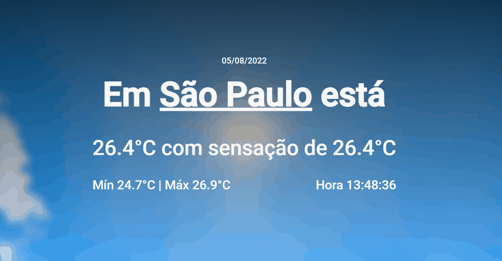

<h1 align='center'>Any Weather</h1>

<h1></h1>

Nos meus primeiros meses aprendendo programação em 2020, fiz um sistema de climas usando python. O sistema era bem simples, você colocava algum lugar no mundo e ele mostrava a temperatura que estava lá.

Decidir recriar esse sistema mas com mais algumas informações a mais, como temperatura mínima, máxima, sensação, a data e as horas.

O projeto é bem simples, quando você abre o site já vem com o lugar padrão, São Paulo. Quando o lugar é editado e a tecla enter é pressionada vai mostrar as infomações do lugar desejado, essas informações são: Temperatura, sensação térmica, data, temperatura mínima e máxima do dia, a hora do local e a imagem de fundo é como o céu está.

Todas as informações são tiradas da API "OPEN WEATHER".

Tecnologias
* JavaScript (usando o fetch)
* HTML
* CSS

<a href='https://any-weather.netlify.app'>any-weather.netlify.app</a>